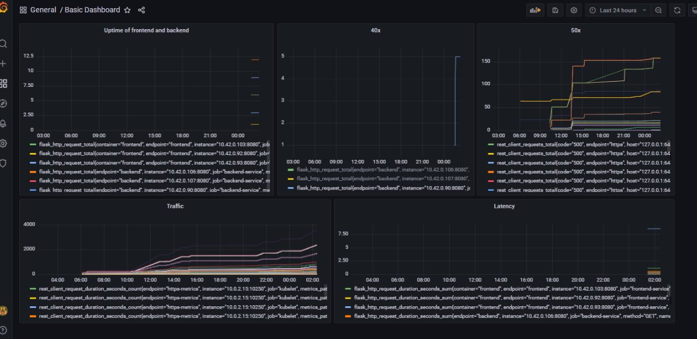

## pods and services


## grafana home


## Create a Basic Dashboard


## Creating SLI metrics

1. Time for a request to respond.
2. The number of failed requests.
3. The number of requests over a period of time.
4. CPU and Memory utilization by the service.
5. Fronted & Backend service uptime.

## Create a Dashboard to measure our SLIs


## Tracing our Flask App


### TROUBLE TICKET

Name: Error on trial/app/app.py

Date: 16/9/2022

Subject:  Response 500 code while accessing trial-service

Affected Area: Home page of trial-service route

Severity: High

Description: We can not access to trial-service home page and in jaeger, trial_service:get-python-jobs trace message is shown.


```
Name: POST Request to `localhost:8081/star` gives 500 error

Date: 16-9-2022

Subject: Upon sending a POST request to Backend API star endpoint i.e `localhost:8081/star` with payload is failing with 500 error

Affected Area: Backend API /star endpoint

Severity: 1

Description: MongoDB instance is not set up properly which is causing the 500 
error
```

## Creating SLIs and SLOs

We want to create an SLO guaranteeing that our application has a 99.95% uptime per month. Name four SLIs that you would use to measure the success of this SLO.

1. Uptime of application
2. Resources usage of application such as CPU, Memory and Disk
3. Request and Response of Application
4. Latency

Building KPIs for our plan

1. Uptime of application
  * Frontend & backend applications uptime
  
2. Resource Usage
  * CPU usage
  * Memory usage
  * Disk usage
  

3. Request and Response of Application
  * Successful responses 
  * Failure responses 

4. Latency
  * Average response time
  * Total requests per minute
  
Final Dashboard


1. Uptime of  application
  * Frontend and Backend uptime to watch the status of applications

2. Resources Usage of application
  * CPU Usage
  * Memory Usage

3. Request and Reponse of application
  * Application request and response time

4. Failure Rate

5. Distributed Tracing
  * jaeger tracing total for frontend and backend
